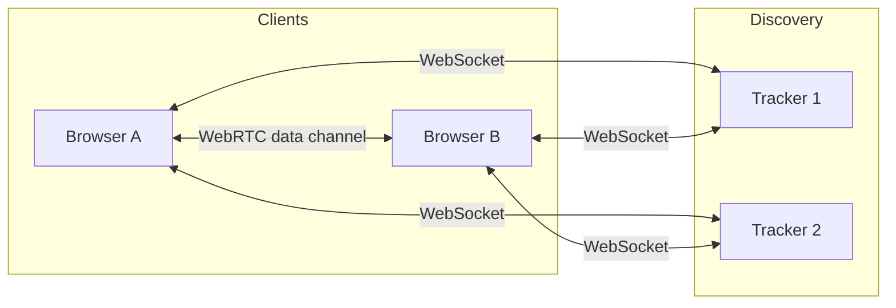

# P2P Chess — Architecture

## High-level overview

P2P Chess is a decentralized multiplayer chess application. There is no central game server: peers discover each other via public (or self-hosted) WebTorrent trackers and then communicate over WebRTC data channels.

- **Trackers**: WebSocket (WSS) to WebTorrent-compatible trackers. Used only for discovery/signaling (finding peers and exchanging WebRTC offers/answers). Default list can be overridden via `NEXT_PUBLIC_P2P_TRACKERS`.
- **WebRTC**: After discovery, peers connect directly (or via TURN if configured) and send game messages over data channels.

## Stack

| Layer      | Technology |
|-----------|------------|
| UI        | Next.js 15 (static export), React 19, TailwindCSS |
| P2P       | Trystero (torrent strategy), WebTorrent trackers, WebRTC |
| Game      | chess.js (rules), react-chessboard (board UI) |
| State     | Zustand (user, lobby, game, UI) |
| Persistence | IndexedDB via idb-keyval (ELO, name, game history) |

## Data flow

### Lobby

1. Client joins lobby room (e.g. `p2p-chess-global`) via Trystero.
2. Client sends periodic **heartbeat** (ELO, username, ready, timestamp); receives heartbeats from others and updates peer list.
3. User selects a peer and sends **challenge** (gameId, color, challenger name/ELO) to that peer.
4. Other peer sends **challResp** (accept/decline). On accept, both clients navigate to the game URL and join the game room `p2p-chess-{gameId}`.

### Game

1. Clients join the game room as **player** (with `color=w` or `color=b`) or **spectator** (e.g. `spectate=1` or no color). Each joiner sends a **role** message so all peers know `whitePeerId` and `blackPeerId`. Only those two peers may send **move** and **gameEvent**; spectators are read-only.
2. **Shared event log**: Each move or game event is broadcast as a **history** payload (with monotonic `seq`). All participants receive the same log; late joiners receive the full log via **histSync**. Board state (FEN, moveHistory, result) is derived by replaying the log in order.
3. **White** sends **sync** (initial FEN) and **histSync** (full log when non-empty) to new joiners so players and spectators see the same state.
4. Chat: any participant may send **chat**.

### State

| Store       | Content | Persisted |
|------------|---------|-----------|
| User       | ELO, peak ELO, name (username) | Yes (IndexedDB + localStorage for name) |
| Lobby      | Peers list, pending challenge | No |
| Game       | gameId, roomId, fen, myColor, whitePeerId, blackPeerId, result, moveHistory, gameEventLog, chatMessages, clocks, drawOfferFrom | No (except ELO update after game) |
| UI         | Theme, sound enabled | Yes (localStorage) |

## Discovery and NAT

- **Trackers**: Required for peers to find each other. The app uses multiple WSS trackers for redundancy. If all trackers are unreachable, no discovery is possible. Operators can run their own WebTorrent-compatible tracker (e.g. [bittorrent-tracker](https://github.com/webtorrent/bittorrent-tracker)) and set `NEXT_PUBLIC_P2P_TRACKERS`.
- **STUN/TURN**: Optional NAT traversal is supported via environment variables. Set `NEXT_PUBLIC_STUN_URL` (e.g. `stun:stun.l.google.com:19302`) and optionally `NEXT_PUBLIC_TURN_URL`, `NEXT_PUBLIC_TURN_USERNAME`, `NEXT_PUBLIC_TURN_CREDENTIAL` so WebRTC can connect behind strict NATs or firewalls. The P2P layer passes these as `rtcConfig.iceServers` to Trystero when set.
- **Connection tips**: If connections fail, try another network, allow WebRTC in the browser/firewall, or use a VPN. Running your own TURN server improves reliability for users behind symmetric NAT.

## Security and limitations

- **No server-side auth**: Anyone who knows the room ID can join. Identity is by peer ID and self-declared username (no verification).
- **Player vs spectator**: The two players are established via **role** messages (player + color). Only those peers may send **move** and **gameEvent**; receivers ignore move/gameEvent from any other peer. Spectators cannot send moves or game events; the UI disables controls in spectator mode.
- **Trust**: Assume peers can send arbitrary messages; validate FEN and game events and ignore invalid data.
- **Privacy**: All traffic is P2P (and optionally via TURN); no central log of moves or chat. ELO and game history are stored only locally (and optionally submitted to a voluntary ranking service).

## Ranking and federation

- **Local ELO**: Computed and stored on device; updated after each game (see `lib/elo.ts`).
- **Voluntary ranking**: An optional ranking API (see `documentation/ranking-api.md`) allows clients to submit game results to a central (or federated) service for a global leaderboard. User consent and configurable.
- **Federated ranking**: Protocol and docs can describe how instances report results so third parties can build federated ELO or ladders.

## Comparison with Chess.com and Lichess

| Aspect | This project (fediverse P2P) | Chess.com | Lichess |
|--------|------------------------------|-----------|---------|
| **Hosting** | Decentralized / self-hostable; no central game server | Centralized, proprietary | Centralized, open source |
| **Data ownership** | Games and ELO on your device / your instance | Held by Chess.com | Held by Lichess |
| **Interoperability** | Open protocol; anyone can build clients and servers | Closed API; limited export | Open API; PGN/import/export |
| **Matchmaking** | Lobby + ELO range in shared room; optional central ranking | Central matchmaking, ratings | Central matchmaking, ratings |
| **Dependencies** | Public trackers (or your own) for discovery | None for user | None for user |
| **Advantages** | Censorship-resistant, multi-client via SDKs, same protocol across instances | Polished UX, lessons, large user base | Free, no ads, strong engine, open source |
| **Disadvantages** | Tracker and NAT reliance, smaller user base, no central ranking — see plan for mitigations | Closed, data not yours | Single instance, not P2P |

See the [README](../README.md) and [Protocol](protocol.md) for more.
