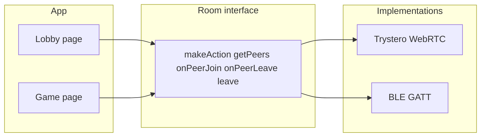
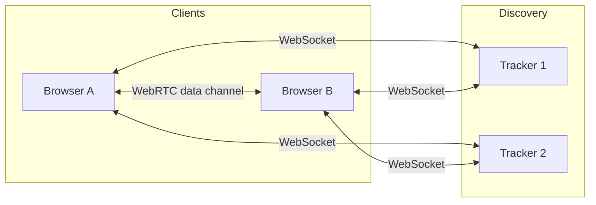
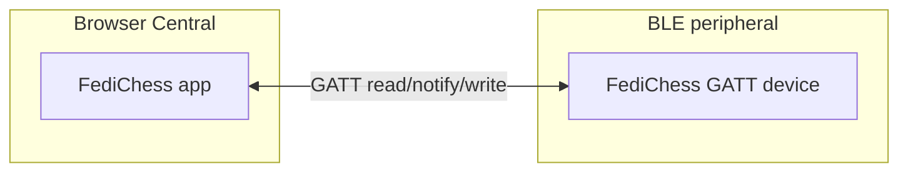

# FediChess — Architecture

Documentation index: [README.md](README.md).

## High-level overview

FediChess is a decentralized multiplayer chess application. There is no central game server. The same **wire protocol** (rooms, action names, JSON payloads) runs over two **transports**: **WebRTC** (online, many peers) and **BLE** (nearby, 1:1). Lobby and game code use a shared **Room** interface so both transports are handled uniformly.

### Transport abstraction

- **Room** (`lib/transport-types.ts`): `makeAction(name) → [send, get]`, `getPeers()`, `onPeerJoin`, `onPeerLeave`, `leave()`. Same API for lobby and game.
- **WebRTC** (`lib/p2p.ts`): Trystero rooms; discovery via trackers; data over WebRTC data channels.
- **BLE** (`lib/ble-transport.ts`): One GATT connection = one peer; length-prefixed messages; stored room when navigating lobby → game.

### WebRTC (online)

- **Trackers**: WebSocket (WSS) to WebTorrent-compatible trackers. Used only for discovery/signaling. Default list overridden via `NEXT_PUBLIC_P2P_TRACKERS`.
- **WebRTC**: After discovery, peers connect directly (or via TURN) and send game messages over data channels.

### BLE (nearby)

- **Role**: The web app is a **central** only (initiates connection). The other side must be a **peripheral** advertising the FediChess GATT service (service UUID and characteristic UUID in [protocol.md](protocol.md)).
- **Scope**: 1:1. Lobby = one BLE peer; game = same connection. Stored in memory when navigating lobby → game so the game page reuses it.
- **Message format**: Length-prefixed (4 bytes) + `actionName` + newline + JSON. Same action names and payloads as WebRTC.

## Stack

| Layer      | Technology |
|-----------|------------|
| UI        | Next.js 15 (static export), React 19, TailwindCSS |
| P2P       | Trystero (torrent), WebTorrent trackers, WebRTC; BLE via Web Bluetooth (`lib/ble-transport.ts`). Shared Room interface (`lib/transport-types.ts`). |
| Game      | chess.js (rules), react-chessboard (board UI) |
| State     | Zustand (user, lobby, game, UI); peers tagged by `transport: 'webrtc' \| 'ble'` |
| Persistence | IndexedDB via idb-keyval (ELO, name, game history). Account backup (export/import) is HMAC-signed with user password for integrity so backups cannot be edited for fair play. |

## Data flow

### Lobby

- **WebRTC**: Client joins lobby room (e.g. `p2p-chess-global`) via Trystero. Sends periodic **heartbeat**; receives others'; peer list tagged **Online**. Challenge and **challResp** over the same room.
- **BLE**: User clicks "Connect via BLE"; device picker; connect to FediChess GATT device. Heartbeats over BLE; one peer appears as **Nearby**. Challenge and **challResp** over the same BLE connection. On accept, app stores the BLE room and navigates to game with `transport=ble`.

### Game

- **WebRTC**: Both join `p2p-chess-{gameId}` via Trystero. **Role**, **move**, **chat**, **gameEvent**, **sync**, **history**, **histSync** as in protocol.
- **BLE**: Game page reads `transport=ble` from URL; retrieves stored BLE room (set when accepting in lobby). Same actions over the single BLE link; `selfPeerId` is session-stable (from `createBleRoom`).

Common flow: (1) Join room (WebRTC or BLE). (2) Send **role** (player/spectator, color); only the two players may send **move** and **gameEvent**. (3) **Shared event log** via **history** (monotonic `seq`); late joiners get **histSync**. (4) **White** sends **sync** and **histSync** to new joiners. (5) Chat: any participant.

### State

| Store       | Content | Persisted |
|------------|---------|-----------|
| User       | ELO, peak ELO, name (username) | Yes (IndexedDB + localStorage for name) |
| Lobby      | Peers list, pending challenge | No |
| Game       | gameId, roomId, fen, myColor, whitePeerId, blackPeerId, result, moveHistory, gameEventLog, chatMessages, clocks, drawOfferFrom | No (except ELO update after game) |
| UI         | Theme, sound enabled | Yes (localStorage) |

## Discovery and NAT

- **WebRTC — Trackers**: Required for online peers to find each other. Multiple WSS trackers for redundancy. Run your own WebTorrent-compatible tracker and set `NEXT_PUBLIC_P2P_TRACKERS`.
- **WebRTC — STUN/TURN**: Optional. Set `NEXT_PUBLIC_STUN_URL` and optionally `NEXT_PUBLIC_TURN_*` so WebRTC works behind strict NATs. Passed as `rtcConfig.iceServers` to Trystero.
- **BLE**: No trackers. User triggers "Connect via BLE"; browser shows device picker filtered by FediChess service UUID. The other side must advertise that service (native app or peripheral). Chrome/Edge on HTTPS or localhost.

## Stability and edge cases

- **BLE disconnect (lobby)**: On peer leave, the app clears the heartbeat timer, BLE room ref, and removes the BLE peer from the list. If the pending challenge was from that peer, it is cleared and the user sees "Disconnected from nearby device." Accept/decline is guarded: if transport is BLE and the BLE room is gone, the challenge is cleared with a message instead of falling back to WebRTC.
- **BLE disconnect (game)**: `onPeerLeave` clears the stored BLE room and `gameRoomRef` before showing "You Win". Refresh or re-entry then sees "BLE game not found" instead of a dead reference.
- **Page refresh**: **Lobby** — WebRTC re-joins; BLE connection is lost (no persistence). **Game (WebRTC)** — Re-join gives a new peer id; opponent may see leave and get a win. **Game (BLE)** — Stored room is in memory only; after refresh, `getGameRoomBle` returns null and the app shows an error.
- **Cleanup**: Lobby unmount calls `clearBleLobby()` (timer + leave room + clear ref). Game unmount calls `leaveRoom` (WebRTC) or `clearStoredBleGameRoom()` (BLE). `clearStoredBleGameRoom()` nulls storage first then calls `room.leave()` in try/catch so it is safe to call multiple times.
- **Challenge/accept over BLE**: If the user accepts a BLE challenge after the BLE device disconnected, the app detects missing BLE room and does not send over WebRTC; it clears the challenge and shows an error.

## Security and limitations

- **No server-side auth**: Anyone who knows the room ID can join. Identity is by peer ID and self-declared username (no verification).
- **Player vs spectator**: The two players are established via **role** messages (player + color). Only those peers may send **move** and **gameEvent**; receivers ignore move/gameEvent from any other peer. Spectators cannot send moves or game events; the UI disables controls in spectator mode.
- **Trust**: Assume peers can send arbitrary messages; validate FEN and game events and ignore invalid data.
- **Privacy**: All traffic is P2P (and optionally via TURN); no central log of moves or chat. ELO and game history are stored only locally (and optionally submitted to a voluntary ranking service).

## Ranking and federation

- **Local ELO**: Computed and stored on device; updated after each game (see `lib/elo.ts`).
- **Voluntary ranking**: An optional ranking API (see `documentation/ranking-api.md`) allows clients to submit game results to a central (or federated) service for a global leaderboard. User consent and configurable.
- **Federated ranking**: Protocol and docs can describe how instances report results so third parties can build federated ELO or ladders.

## Comparison with Chess.com and Lichess

| Aspect | This project (fediverse P2P) | Chess.com | Lichess |
|--------|------------------------------|-----------|---------|
| **Hosting** | Decentralized / self-hostable; no central game server | Centralized, proprietary | Centralized, open source |
| **Data ownership** | Games and ELO on your device / your instance | Held by Chess.com | Held by Lichess |
| **Interoperability** | Open protocol; anyone can build clients and servers | Closed API; limited export | Open API; PGN/import/export |
| **Matchmaking** | Lobby + ELO range in shared room; optional central ranking | Central matchmaking, ratings | Central matchmaking, ratings |
| **Dependencies** | Public trackers (or your own) for discovery | None for user | None for user |
| **Advantages** | Censorship-resistant, multi-client via SDKs, same protocol across instances | Polished UX, lessons, large user base | Free, no ads, strong engine, open source |
| **Disadvantages** | Tracker and NAT reliance, smaller user base, no central ranking — see plan for mitigations | Closed, data not yours | Single instance, not P2P |

See the [README](../README.md) and [Protocol](protocol.md) for more.
